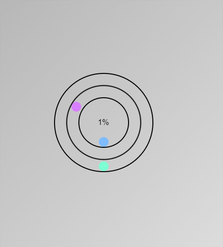

# Custom loading
Este repositorio contiene un componente de ventana de carga (Custom-loading) que permite mostrar una ventana animada de carga a los usuarios pudiendo establecer un tiempo determinado hasta la finalización de la carga o aumentando el porcentaje de completado de la operación en curso.

# Características

-Dado un tiempo en segundos la interfaz de pantalla de carga mostrará el porcentaje de completado de la tarea.
-Mostrar el porcentaje de completado de una tarea pasando como parametro el porcentaje completado.

# Instalación

1. Clona el repositorio.
2. Añade el componente vue a tu punto de montaje vue para integrar el elemento.

# Parametros

### estimatedTime

- Tiempo estimado en segundos que establece el porcentaje a mostar hasta llegar al 100%
---

### ReferenceType

- Por defecto se encuentra establecido como "time" para usar ***estimatedTime***, pudiendose configurar como "manual" si se desea establecer de forma manual el porcentaje que se muestra en pantalla
---

# Funciones accesibles

### increasePercent

- Incrementa el porcentaje de forma manual cuyo primer parametro es la cantidad de porcentaje a aumentar por ejemplo si porcentaje = 40% y se desea que pase a 45% el valor a usar en la función es 5.
---
# Eventos

### on-mounted

- Este evento se encarga de mandar un json con la instancia del propio componente, si se desea usar el modo "manual" este evento ayudará a la instancia superior a recuperar la instancia y acceder a sus funciones.

### finished

- Este evento se lanza cuando el componente se encuentra en modo "time" una vez llegado al 100%.
---

# Configuración

### Usando un tiempo estimado 

1. Para eliminar la ventana de carga es necesario usar una variable con v-if para eliminar el compontente de la interfaz cuando deja de ser necesario o cuando lo asi lo establezca la funcion del evento finished
```
    <custom-loading
        v-if="loading"
        :estimated-time="10"
        @finished="customFinished"
        @on-mounted="onMoutedLoading"
    ></custom-loading>
```

### Usando valores especificos

1.Con la siguiente configuración una vez se obtiene la instancia del componente se puede usar la funcion ***increasePercent*** para aumentar el porcentaje de completado de la tarea

```
    <custom-loading
        v-if="loading"
        reference-type="manual"
        @on-mounted="onMoutedLoading"
    ></custom-loading>
```

<p align="center">
   
</p>

